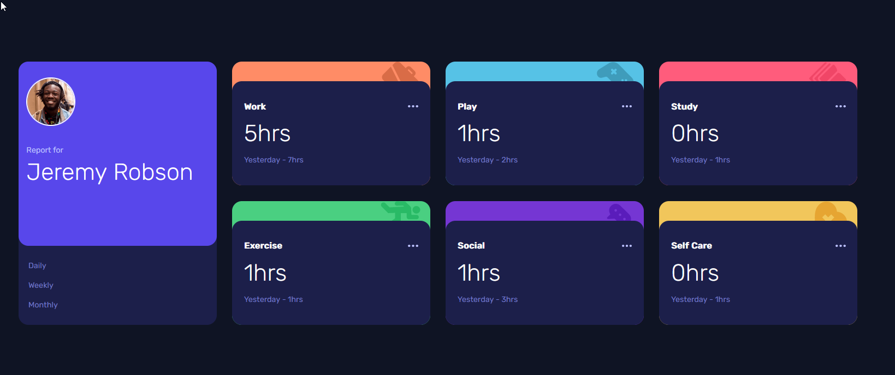
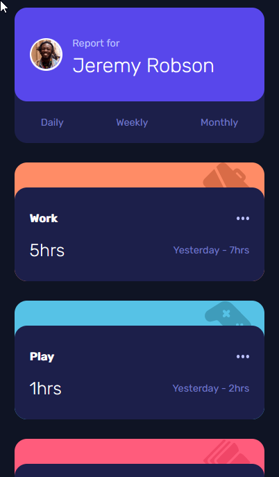

# Frontend Mentor - Time tracking dashboard solution

This is a solution to the [Time tracking dashboard challenge on Frontend Mentor](https://www.frontendmentor.io/challenges/time-tracking-dashboard-UIQ7167Jw). Frontend Mentor challenges help you improve your coding skills by building realistic projects.

## Table of contents

-   [Overview](#overview)
    -   [The challenge](#the-challenge)
    -   [Screenshot](#screenshot)
    -   [Links](#links)
-   [My process](#my-process)
    -   [Built with](#built-with)
    -   [What I learned](#what-i-learned)
    -   [Continued development](#continued-development)
-   [Author](#author)

## Overview

### The challenge

Users should be able to:

-   View the optimal layout for the site depending on their device's screen size
-   See hover states for all interactive elements on the page
-   Switch between viewing Daily, Weekly, and Monthly stats

### Screenshot

#### Desktop View

#### Mobile View

### Links

-   Github Repo: [Github Repo](https://github.com/cmdarcy/9-21-timetracking)
-   Live Site: [Live site](https://cmdarcy.github.io/9-21-timetracking/)

## My process

### Built with

-   Semantic HTML5 markup
-   CSS custom properties
-   Flexbox
-   CSS Grid
-   Mobile-first workflow

### What I learned

-   How to implement json data using `fetch()` and `async` `await` functions
-   Utilizing css grid to design layout

### Continued development

I would like to incorporate more json data into future projects to increase my comfortability and efficiency with handling it

## Author

-   Website - [Christopher d'Arcy](https://cmdarcy.github.io/portfolio_website/)
-   Frontend Mentor - [@cmdarcy](https://www.frontendmentor.io/profile/cmdarcy)
